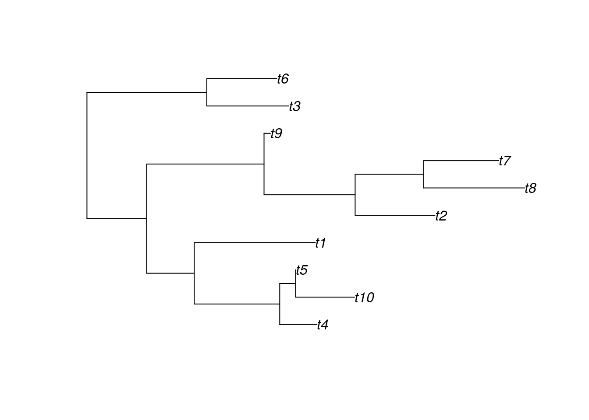

<!-- README.md is generated from README.Rmd. Please edit that file -->
jsPhyloSVG htmlwidget
=====================

The [jsPhyloSVG](http://jsphylosvg.com) javascript library provides a neat visualization tool for phylogenetic trees. This R package, which has the same name, is a wrapper that builds an [htmlwidget](http://www.htmlwidgets.org/) that allows its use in R, including RMarkdown and Shiny. This is still work in progress.

Installation
------------

You can install jsPhyloSVG from github with:

``` r
# install.packages("devtools")
devtools::install_github("USCBiostats/jsPhyloSVG")
```

Example
-------

In the following, we present an example of usage of the widget. First, using the [ape](https://cran.r-project.org/package=ape) package, we create a random phylogenetic tree.

``` r
library(ape)
library(jsPhyloSVG)
```

``` r
x <- rtree(10)
```

Using the `plot.ape` method, we can get a nice tree drawn with ape:

``` r
plot(x)
```



Using the `jsPhyloSVG` function, we can visualize the same tree but using the Javascript library of the same name, [jsPhyloSVG](http://jsphylosvg.com):

``` r
jsPhyloSVG(write.tree(x), width = 500)
```

<!--html_preserve-->

<script type="application/json" data-for="htmlwidget-d7c014a6e9af50d198bd">{"x":{"tree":"(((t10:0.3663676912,t6:0.08196448581):0.3985439157,t2:0.6740024716):0.460521894,(((t1:0.02809911966,(t3:0.5084149721,t9:0.1556197158):0.1782352244):0.20649833,(t5:0.2444876351,t4:0.2051976998):0.1481338032):0.5206618879,(t7:0.7977750886,t8:0.6797057965):0.01867378317):0.488004331);","layout":"circular"},"evals":[],"jsHooks":[]}</script>
<!--/html_preserve-->
